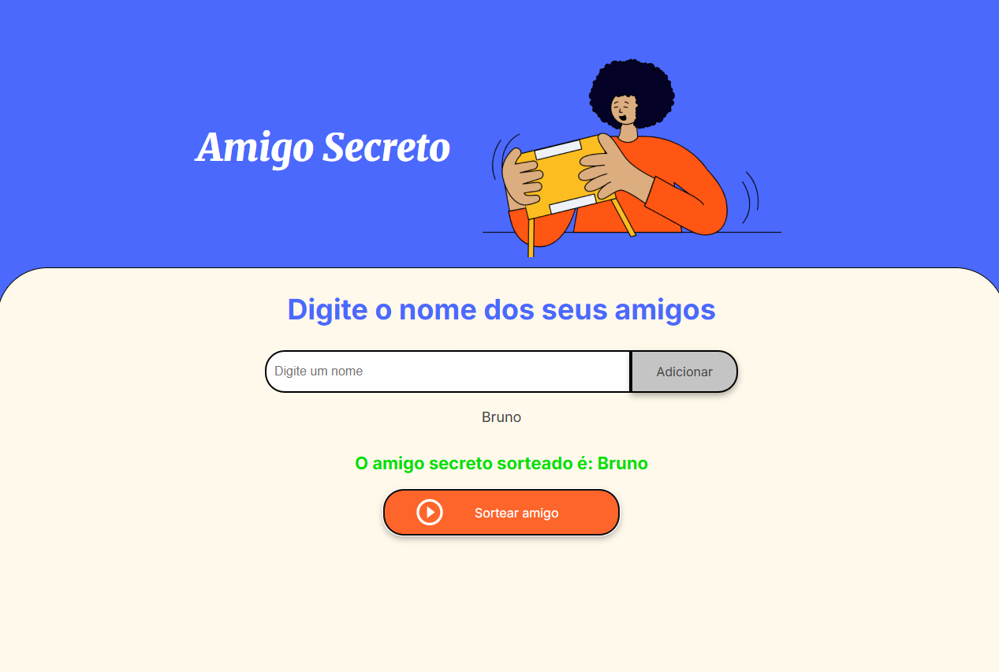

# Amigo Secreto - Desafio Oracle ONE

Este projeto é uma simples aplicação web que permite o usuário adicionar amigos a uma lista de sorteio e por fim, sortear um dos nomes que foram adicionados.

Além disso, o projeto também cumpre um objetivo acadêmico, introduzindo a lógica de programação com javascript ao aluno e permitindo que ele tenha contato prático com os fundamentos da programação e de estruturas de dados básicas, conceitos esses elementares para quaisquer situação de nossas vidas, permitindo que tenhamos senso crítico, visão analítica e desenvolvemos também, a resolução de problemas.

### Como iniciar o projeto?

1. Clone o repositório em sua máquina local (lembre-se de ter o git instalado)
2. Observe que a estrutura da pasta, irá conter os seguintes arquivos:
    - assets (pasta que contém imagens usadas no design da página)
    - app.js (script responsável pela parte lógica da aplicação e o funcionamento)
    - index.html (script que contém o layout da página web e seu esqueleto)
    - style.css (scipt que contém a estilização da página web onde é definida sua aparência)
3. Abra a página web pelo arquivo HTML
    - Alternativas para abrir o HTML:
        - Caso você utilize o VSCode como editor texto e tenha também o plugin 'Live Server' 
        clique com o botão direito em cima do arquivo 'index.html' e posteriormente 'Open with Live Server'
        - Caso não possua o plugin, não há problemas, você pode abrir a estrutura html clicando também com o botão direito  
        e logo após, clicar em 'Abrir no navegador padrão' ou 'Open in default browser'
4. Após a página estar aberta, observe um campo que você poderá adicionar o nome dos seus amigos, digite o nome de cada um e clique em Adicionar, um de cada vez
5. Clique em 'Sortear Amigo'

Saída esperada:
